# コンビニ シフト管理 — 図面集

用語・ルールの定義は [design.md](./design.md) を参照。

---

## 1. ドメインモデル図

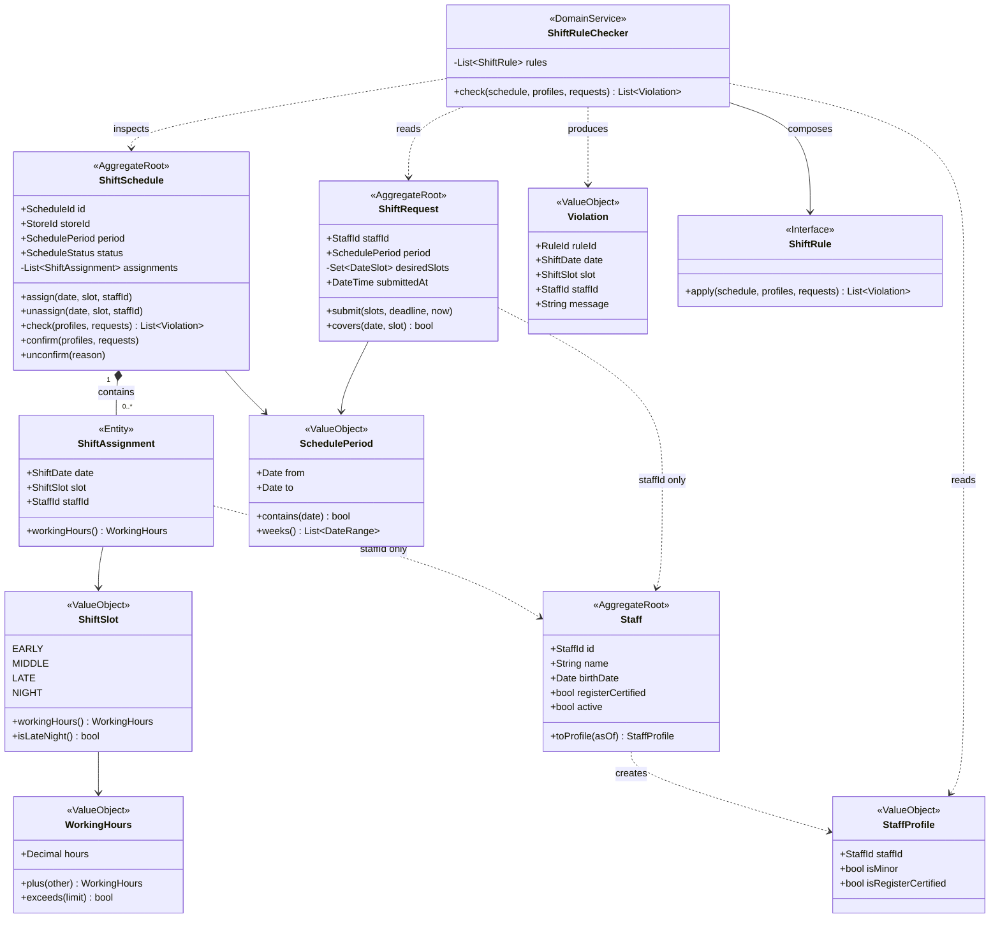

破線は ID 参照のみを表す。集約間でオブジェクト参照は持たない。

---

## 2. 集約境界図

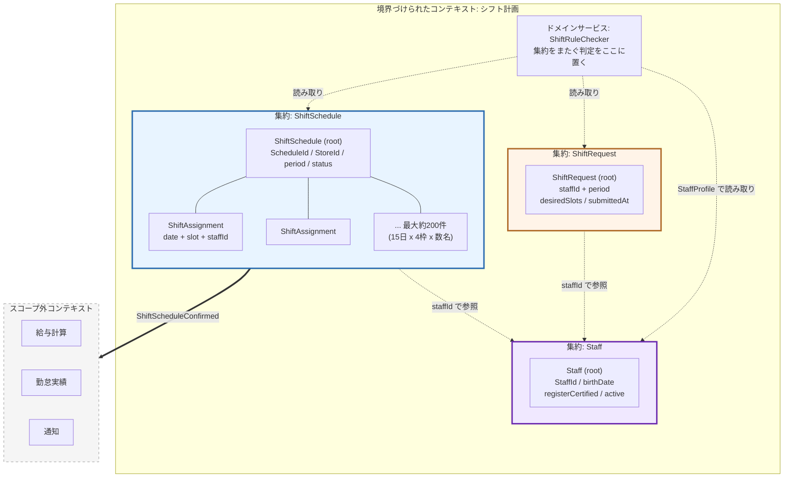

**境界の根拠**

| ルール | 判定に必要な範囲 | 集約内で完結するか |
|---|---|---|
| R-01 深夜×未成年 | 割当1件 + StaffProfile | 引数で受け取れば可 |
| R-02 週40時間 | 対象期間の全割当 | ShiftSchedule 内で完結 |
| R-03 連続勤務日数 | 対象期間の全割当 | ShiftSchedule 内で完結 |
| R-04 深夜翌日の早番禁止 | 連続2日の割当 | ShiftSchedule 内で完結 |
| R-05 最低2名 | 1日1枠の全割当 | ShiftSchedule 内で完結 |
| R-06 レジ研修者1名 | 1日1枠の全割当 + StaffProfile | 引数で受け取れば可 |
| R-07 重複割当 | 割当2件 | ShiftSchedule 内で完結 |
| R-08 希望外割当 | 割当 + ShiftRequest | 引数で受け取れば可 |

トランザクション境界の外に出るのは `ShiftRequest` と `Staff` の読み取りのみ。
書き込みは常に1集約に閉じる。

---

## 3. 状態遷移図

### ShiftSchedule

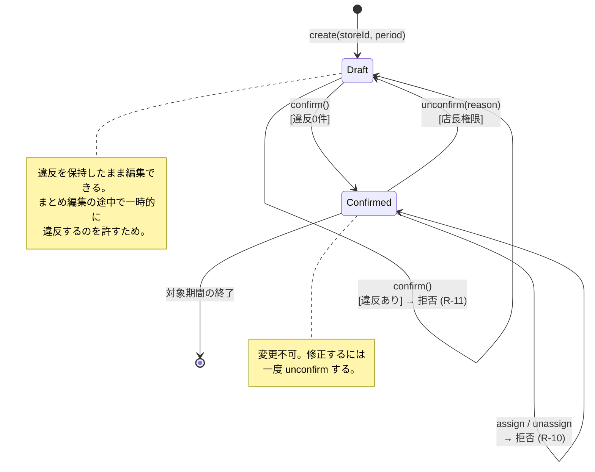

### ShiftRequest

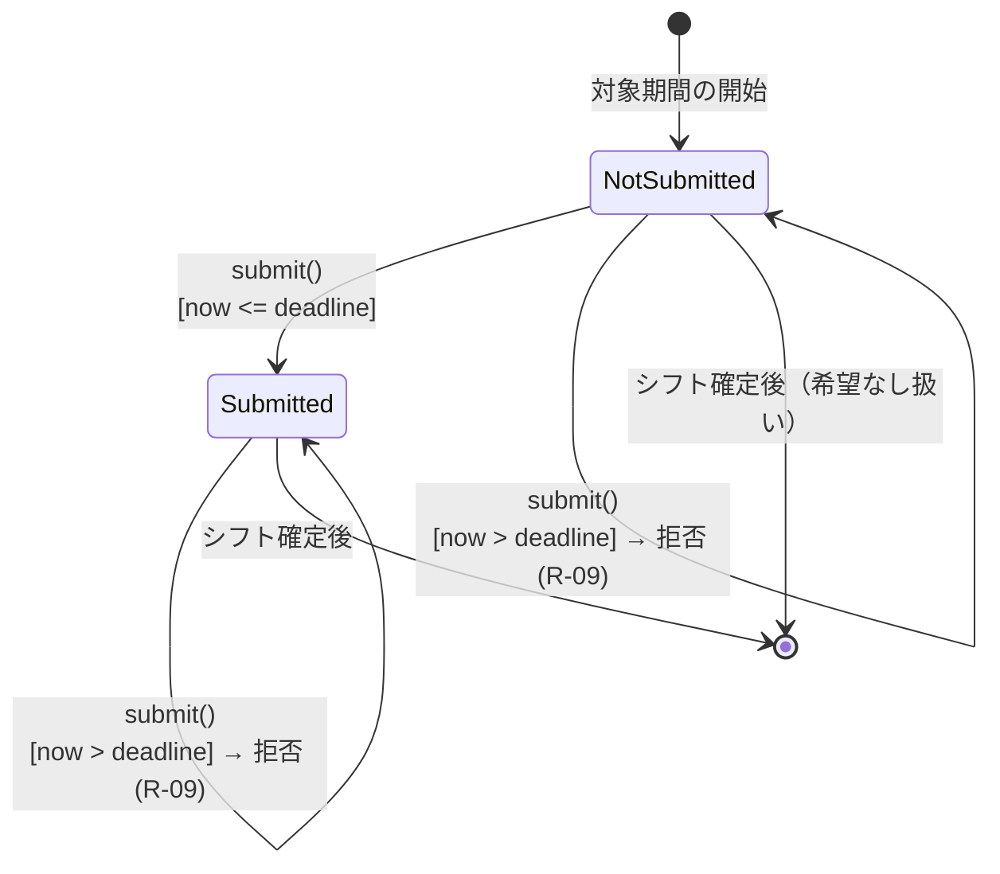

---

## 4. シーケンス図

### S-01 正常系: 割当から確定まで

```mermaid
sequenceDiagram
    actor M as 店長
    participant App as ShiftAppService
    participant SchR as ShiftScheduleRepository
    participant StfR as StaffRepository
    participant ReqR as ShiftRequestRepository
    participant Sch as ShiftSchedule
    participant Chk as ShiftRuleChecker
    participant Bus as EventBus

    M->>App: assign(scheduleId, date, slot, staffId)
    App->>SchR: findById(scheduleId)
    SchR-->>App: ShiftSchedule (Draft)
    App->>Sch: assign(date, slot, staffId)
    Note over Sch: R-10 確定済みでないか確認<br/>R-07 重複でないか確認
    Sch-->>App: ShiftAssignmentAdded
    App->>SchR: save(schedule)
    App-->>M: 追加完了

    M->>App: check(scheduleId)
    App->>SchR: findById(scheduleId)
    App->>StfR: findByIds(割当中の staffId 一覧)
    StfR-->>App: List~Staff~
    Note over App: Staff → StaffProfile へ変換<br/>集約の内部を渡さない
    App->>ReqR: findByPeriod(period)
    ReqR-->>App: List~ShiftRequest~
    App->>Chk: check(schedule, profiles, requests)
    loop 各 ShiftRule
        Chk->>Chk: rule.apply(...)
    end
    Chk-->>App: List~Violation~ (空)
    App-->>M: 違反なし

    M->>App: confirm(scheduleId)
    App->>Chk: check(schedule, profiles, requests)
    Chk-->>App: List~Violation~ (空)
    App->>Sch: confirm()
    Note over Sch: R-11 違反0件を確認<br/>status = Confirmed
    Sch-->>App: ShiftScheduleConfirmed
    App->>SchR: save(schedule)
    App->>Bus: publish(ShiftScheduleConfirmed)
    App-->>M: 確定完了
```

### S-03 違反あり: 18歳未満を深夜番に割当

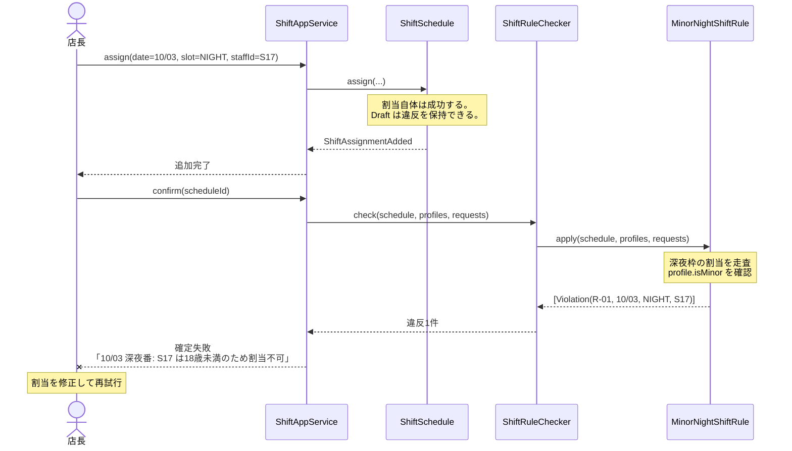

### S-02 締切後の希望提出

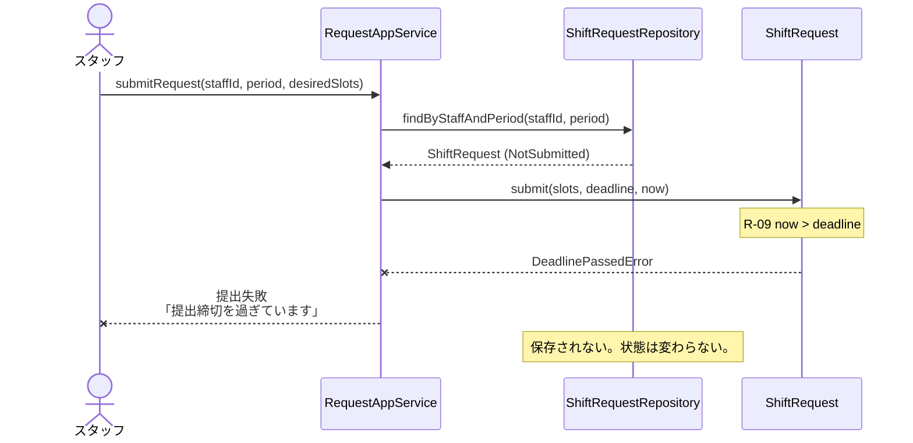

---

## 5. フロー図

### 全体業務フロー

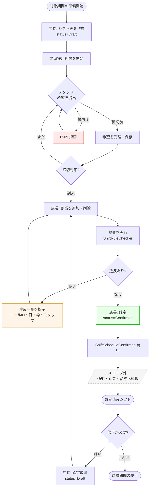

### 検査処理の内部フロー

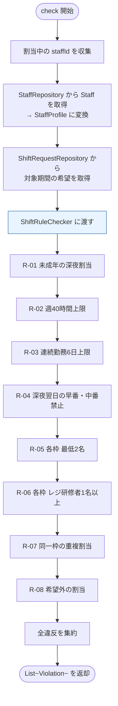

各ルールは `ShiftRule` の実装として独立している。途中で打ち切らず全て適用し、
違反をまとめて返す。店長が1件ずつ直して再実行する手間を避けるため。

---

## 6. ER図（対象スコープのみ）

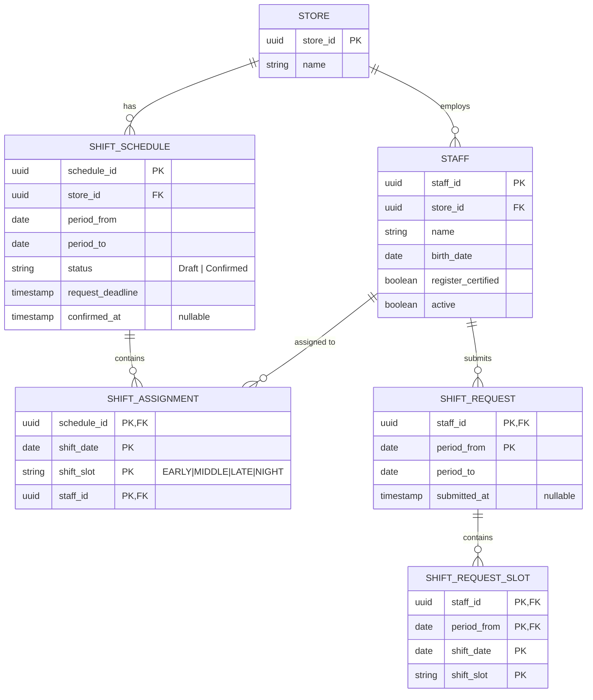

**永続化の方針**

- `SHIFT_ASSIGNMENT` の主キーは `(schedule_id, shift_date, shift_slot, staff_id)` の
  複合キー。R-07（重複割当禁止）はこの主キー制約でも担保される。ドメイン側の検査と
  二重になるが、DB制約は最後の砦として残す。
- `SHIFT_SCHEDULE` に `(store_id, period_from)` の一意制約を置く。
  同一店舗・同一期間のシフト表は1つだけ。
- 集約単位で保存する。`ShiftScheduleRepository.save()` は `SHIFT_SCHEDULE` と
  配下の `SHIFT_ASSIGNMENT` を1トランザクションで書き込む。
- `SHIFT_ASSIGNMENT` に代理キーを置かない。割当は集約内部のエンティティであり、
  外部から単独で参照されないため。

**スコープ外のためテーブルを持たないもの**

勤怠実績、給与、シフト交代申請、欠勤連絡、通知履歴。

---

## 7. シナリオパターン一覧

詳細は [design.md 第7章](./design.md#7-シナリオパターン) を参照。

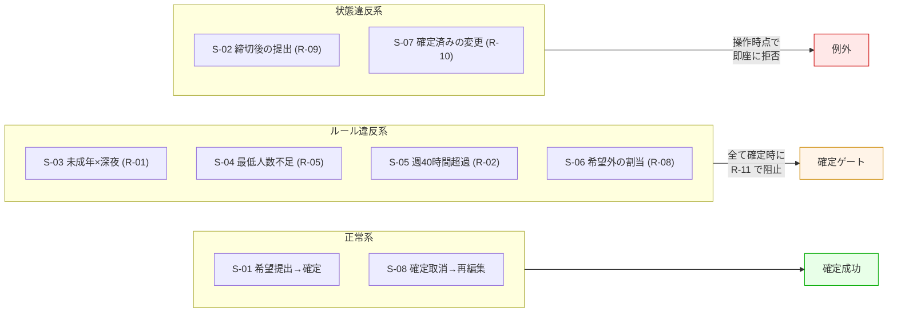

**2種類の拒否の使い分け**

| 種類 | 対象 | タイミング | 表現 |
|---|---|---|---|
| 状態違反 | R-09, R-10 | 操作の時点 | 例外を投げる。操作は成立しない |
| ルール違反 | R-01〜R-08 | 確定の時点 | `Violation` として蓄積。編集は続行できる |

前者は「その操作自体が無効」、後者は「その状態では確定できない」。
Draft が違反を保持できることが、この設計の核になっている。
